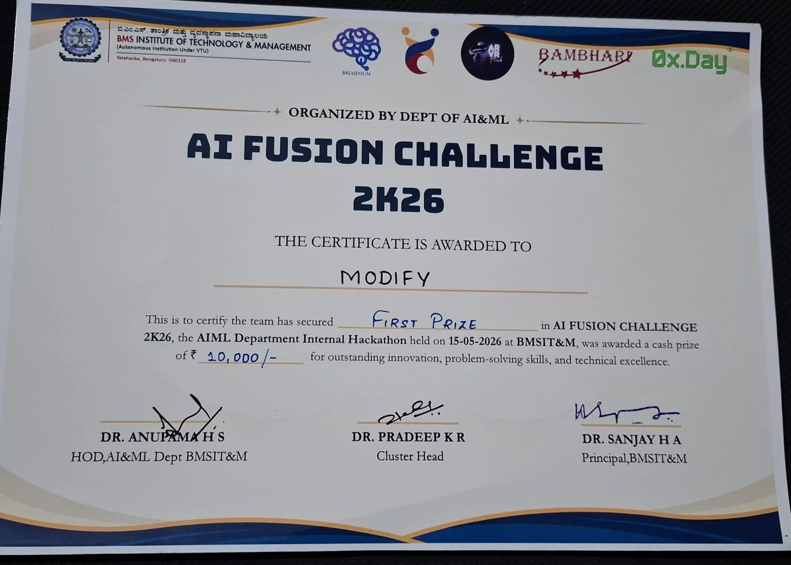
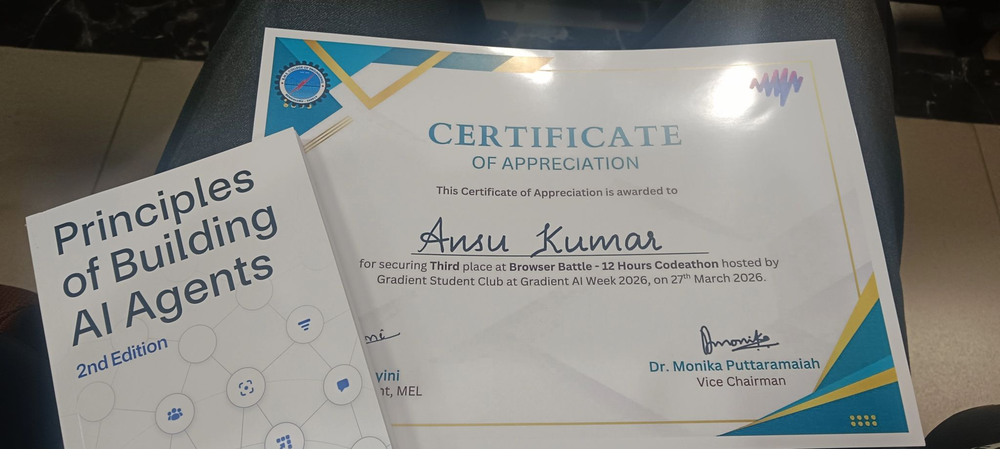
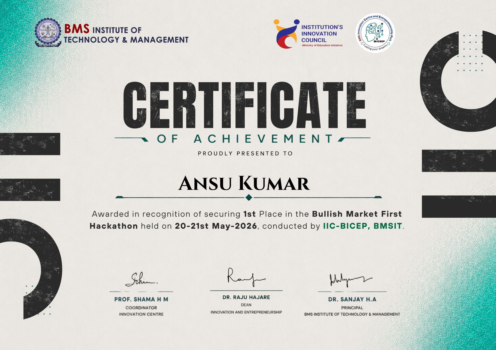
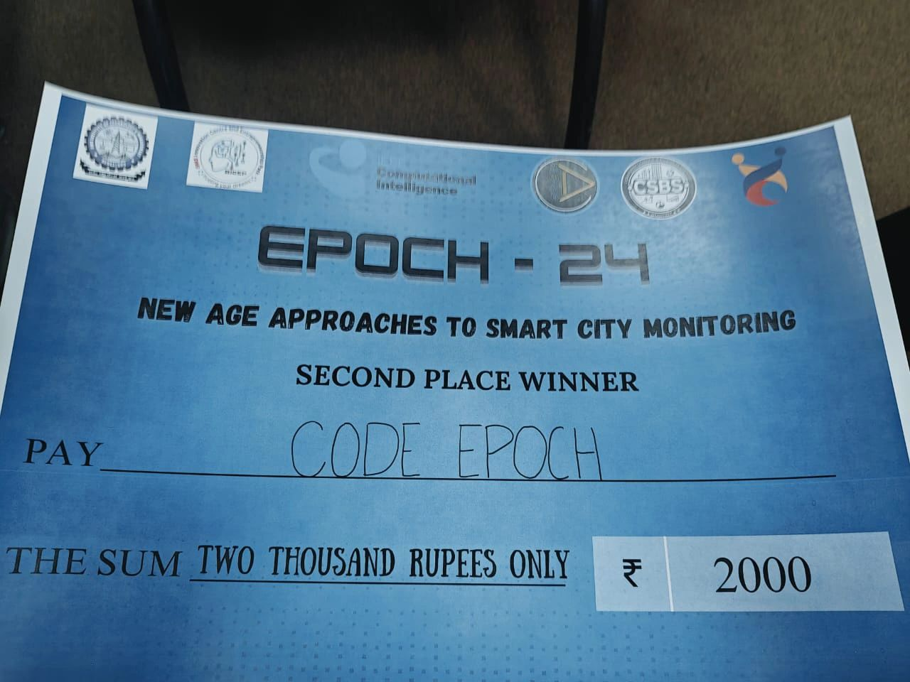
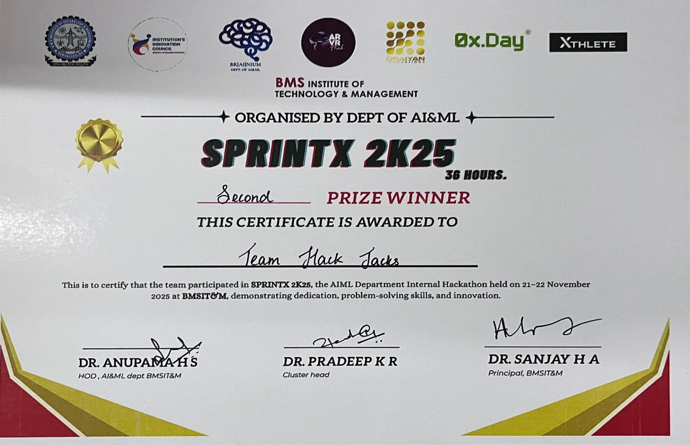
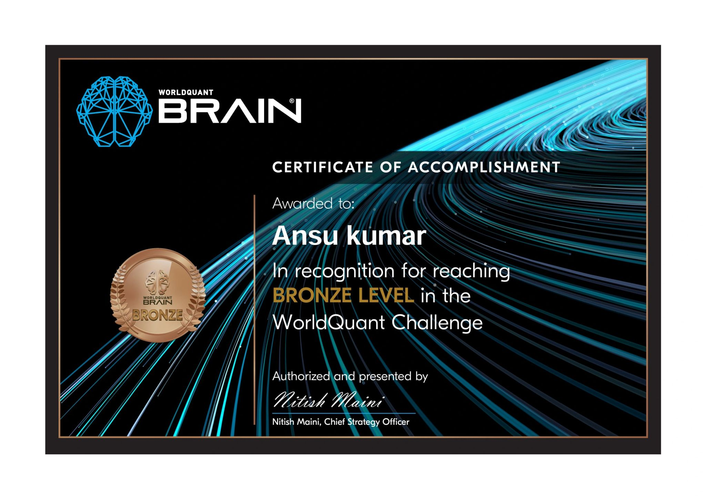
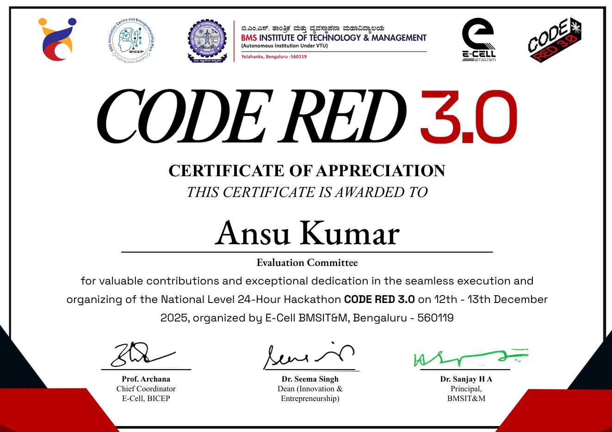

        
     
     
    

    
    
    
    

# 👋 Hi, I'm Ansu Kumar

> **AI & ML undergraduate** · Full-Stack Developer · Open Source Enthusiast · 7× Hackathon Winner

I'm studying **Artificial Intelligence & Machine Learning** at **BMS Institute of Technology & Management, Bengaluru**. I love building scalable software, AI-powered applications, and modern web experiences.

---

## 🚀 What I Do

- 💻 Build full-stack web applications using the **MERN stack** and **Next.js**
- 🤖 Develop AI-powered applications using **PyTorch**, **ClinicalBERT**, and **FastAPI**
- 🌐 Design responsive and interactive UIs with **React** and **Tailwind CSS**
- 🏆 Participate in hackathons and open-source programs
- 📚 Continuously learning system design, backend engineering, and machine learning

---

## 💼 Experience

### 🚀 Technical Head — Entrepreneurship Cell, BMSIT&M
`May 2025 – Present` · Bengaluru, India

- Contributed to the official website of **CodeRed 3.0**, BMSIT&M's largest hackathon with **3000+ registrations**
- Built responsive and optimised UI components for the official **E-Cell BMSIT&M website**, serving **700+ students**

### 💻 Web Dev Associate — ARVR Hub, BMSIT&M
`May 2025 – Nov 2025` · Bengaluru, India

- Developed and maintained the official **ARVR Hub website**, reducing page load time by **30%** and enhancing UI responsiveness

---

## 🛠️ Tech Stack

### 💬 Languages

  
  
  
  

### 🌐 Frontend

  
  
  
  

### ⚙️ Backend

  
  
  
  
  

### 🤖 AI / ML

  
  
  
  

### 🗄️ Database & Tools

  
  
  
  
  
  

---

## 🚀 Featured Projects

### 🩺 VitalPath — AI Healthcare Triage & Risk Assessment System

  
  
  
  
  
  

- Built an AI-powered healthcare triage platform integrating **rule-based assessment**, **ML risk scoring**, and **ClinicalBERT-based medical entity extraction** for intelligent patient prioritisation
- Developed **multi-role dashboards** for patients, doctors, and admins with symptom intake, medical report **OCR parsing**, triage overrides, audit logging, and **real-time emergency alerts**
- Implemented scalable **microservice architecture** using FastAPI, Express.js, MongoDB, and transformer-based NLP pipelines supporting real-time clinical insights and predictive healthcare analytics

---

### 🎟️ Participant Portal — Code Red 3.0

  
  
  
  

- Developed a resource management portal for BMSIT&M's largest hackathon, supporting **250+ participants** and streamlining event operations
- Implemented a **QR-based tracking system** for food, sleeping bags, and essential resource distribution, reducing manual effort by **80%**

---

### 📄 PaperLabs — LeetCode for Research Papers

  
  
  
  
  
  

- Built a full-stack learning platform supporting **100+ curated research paper implementation challenges** across ML and AI domains
- Developed an **in-browser Python coding environment** using Pyodide and Monaco Editor with real-time code execution, testing, and progress tracking

---

## 🏆 Achievements

| 🥇 | **7× Hackathon Winner** — Secured winning positions across multiple national and inter-college hackathons |
|---|---|
| 🎯 | **Evaluation Committee Member — Code Red 3.0** — Selected for the evaluation committee at BMSIT&M's flagship hackathon (3000+ participants) while contributing to technical development |
| 🌍 | **GirlScript Summer of Code (GSSoC) Contributor** — Contributed to open-source projects, improving codebases and collaborating with maintainers globally |
| 🤝 | **Placement Coordinator — BMSIT** — Acted as a bridge between the placement cell and students, assisting in communication, coordination, and engagement during placement training |

## � My Organizations (Clickable)

<table>
<tr>
<td></td>
<td></td>
</tr>
<tr>
<td></td>
<td></td>
</tr>
</table>

<h2>🗂 Hackathon Certificates</h2>

<h2>⚜️ Significant certificates</h2>

<h2>📊 Statistics</h2>

